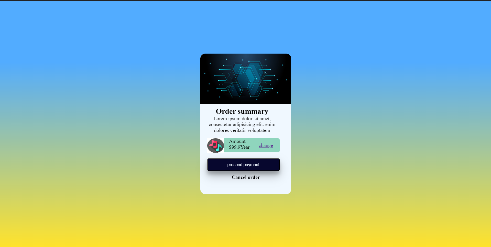

# Order-Card-UI

This is a simple Card UI design built using HTML and CSS, showcasing clean and responsive card components for various use cases.

## Features

- Responsive card layout that adapts to different screen sizes
- Clean and modern design
- Easy to customize for different types of content

## Technologies Used

- **HTML**: Provides the structure for the card layout.
- **CSS**: Adds styles for card appearance, hover effects, and responsiveness.

## Screenshots

